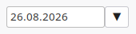
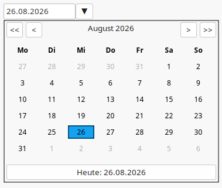

[jump to english version](#datetimepicker-english)
# DateTimePicker

Entwickelt nachdem ich feststellen musste, dass die Xojo DesktopDateTimePicker unter Linux und Windows sehr unterschiedliches aussehen haben und DesktopDateTimePicker für Cross Plattform Entwicklung ungeeignet ist.

Getestet wurde das Tool unter LinuxMint und Windows 11 unter **Xojo 2025r1.1**.

Im Prinzip funktioniert das Tool wie der DesktopDateTimePicker unter Windows, unterstützt zur Zeit aber keine Uhrzeit Funktion, da ich das selbst im Augenblick nicht benötigte. Dies wird aber vielleicht in einer zukünftigen Version noch nachgerüstet.

Im geschlossenen Zustand sieht der Picker genauso aus wie unter Windows: 

Im geöffneten Zustand sieht der Picker wie folgt aus: 

- Beim Start des Pickers wird über den Event `InitalDate` das Datum bei der Hauptanwendung abgefragt, mit dem der Kalender initialisiert werden soll.
- Das Datum kann aber zu jederzeit über die Methode `SetDate` zu jederzeit aktualisiert werden.
- Wird ein Datum ausgewählt, wird dies über den `DateChanged` Event der Hauptanwendung übermittelt
- Ein Datum kann auch direkt in das Datumsfeld eingetragen werden. Dazu muss der Kalender nicht expandiert werden. Sobald ein gültiges Datum erkannt wurde, wird der Kalender Inhalt angepasst und das Datum an die Hauptanwendung übermittelt.

Das Datumsformat passt sich dem im System eingestellten LOCALE an. Es besteht auch die Möglichkeit, eine bestimmte LOCALE zu erzwingen. Übersetzt wurde bis jetzt in Englisch und Deutsch, bei anderen Sprachen werden die Wochentage dann in Englisch angezeigt.

Der Kalender kann auch als PopUp ohne Eingabefeld verwendet werden, eine Demo ist Beispielcode vorhanden.
 
Der Rest sollte selbst Erklärend sein, bei **Mac/IOS muss ich passen**, da ich keine Geräte zum testen habe.

Bug Reports bitte über die Projekt Seite [GitHub](https://github.com/jogicom/Xojo.DateTimePicker)

## Anwendung
Im Sourcecode ist eine kleine Anwendung zum testen des Kalenders enthalten. Um den `DateTimePicker` in deine eigene Anwendung zu übernehmen, kopiere den Ordner `DateTimePicker` in deine Anwendung, fertig!

# DateTimePicker English

Developed after I discovered that the Xojo DesktopDateTimePicker looks very different on Linux and Windows, making it unsuitable for cross-platform development.

The tool was tested on Linux Mint and Windows 11 using **Xojo 2025r.1.1**.

In principle, the tool works like the DesktopDateTimePicker in Windows, but it does not currently support a time function, as I do not need that myself at the moment. However, this might be added in a future version.

When closed, the picker looks exactly the same as it does in Windows: 

When open, the Picker looks like this: 

- When the picker starts, the date used to initialize the calendar is requested from the main application via the `InitialDate` event.
- However, the date can be updated at any time using the `SetDate` method.
- When a date is selected, it is transmitted via the main application's `DateChanged` event.
- A date can also be entered directly into the date field. There is no need to expand the calendar to do this. Once a valid date is recognized, the calendar content is updated and the date is transmitted to the main application.

The date format adapts to the system's locale setting. It is also possible to force a specific locale. Translations are currently available in English and German; for other languages, days of the week are displayed in English.

The calendar can also be used as a pop-up without an input field; a demo and sample code are available.

The rest should be self-explanatory, **I can't help with Mac/iOS**, though, as I don't have any devices to test with.

Please submit bug reports via the project page [GitHub](https://github.com/jogicom/Xojo.DateTimePicker)

# Usage
The source code includes a small application for testing the calendar. To integrate the `DateTimePicker` into your own application, simply copy the `DateTimePicker` folder into your application—that’s it!